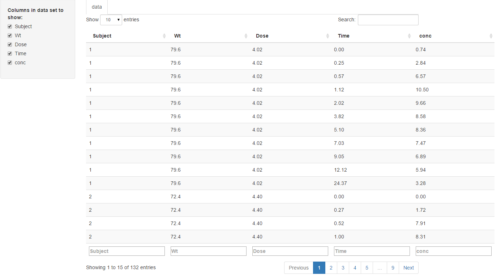

dataView
==================

Data View is a simple shiny app that allows one to emulate 'extending' the 4-pane interface of Rstudio. It can be launched from either a separate Rstudio window, or directly from an R-REPL in a console (recommended).

To launch navigate to the app directory and run

```
shiny::runApp()
```


By default, it will show the `Theoph` dataset. To re-render currently, it simply monitors the app directory
for a file called `data.rds` (which is created by default and is `Theoph`). To overwrite Theoph and use your data, one can simply call the command

```r
saveRDS(data_to_view, "<path-to-dataView>/data.rds")
```

It looks like:




### Functionality

Current functionality is limited to sorting (color changes on sorted column) as well as basic filtering via Search


### note about crashing

If you feed it bad data, it will likely crash. If it becomes unresponsive, just kill the R session and open a new one.

### TODO:

* Add button to uncheck all columns
* Add `sleep` so it consumes less resources will still remaining active - though polling once per second should have minimal CPU load
* Add a file navigator to allow selection of other data in the file-system
* Add ability to watch multiple datasets/folder and render any/all in a folder


### Known bugs:

For columns of type `hms` will show the underlying value (eg seconds since midnight), rather than the human readable printed result (eg 27000 rather than 7:30:00)
